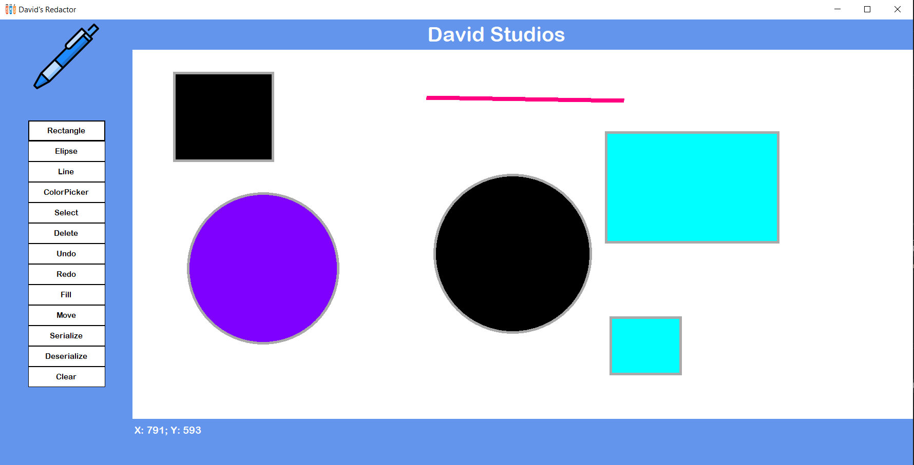
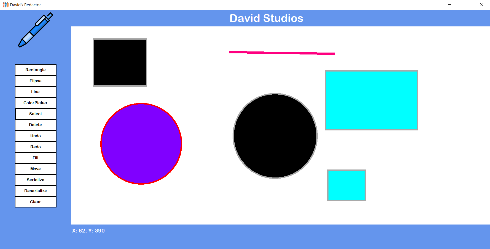

# C# Graphic Redactor
This is a simple graphical editor. The project was assigned as a course project for final assessment in the subject OOP in C#

# Used Technologies
* C# .NET
* C# OOP
* Windows Forms App
* Newsoft Json Library

# What the project contains
In the app you can draw rectangle, ellipse and line shapes. You can select them, delete them, color them and also you can change their position. You can also save them as a picture or a json file that can be loaded back and draw the shapes you saved.

# Images

*Image1

*Image2

